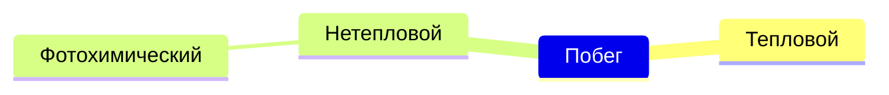

Настоящие модели очень сложны
- Много компенсирующих процессов

Фотохимический побег кислорода на Марсе
- фотодиссоциация
- $CO_2 + гаммаквант → CO + O*$
- Рекомбинации ионов
- $O_2^+ + e → 2O^{-}$

