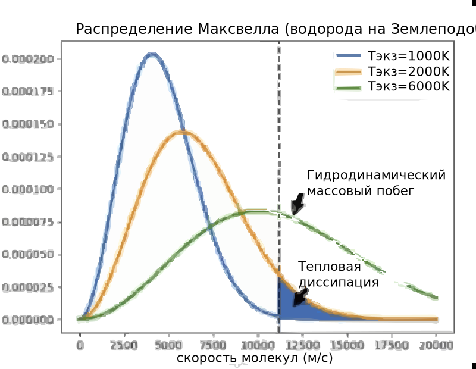

- [Обзорный доклад](https://www.youtube.com/watch?v=FlmquACRbs8)
    - по [Atmospheric Escape Processes and Planetary Atmospheric Evolution](https://www.researchgate.net/figure/The-ionization-at-Mars-Venus-and-Titan-for-similar-solar-conditions-including-a-solar_fig7_341994354)
    - [весь атмосферно-планетарный раздел статей](https://www.researchgate.net/topic/Planetary-Atmospheres/publications)

Настоящие модели очень сложны
- Много компенсирующих процессов
    - Океаны
    - Парниковые газы
    - Метеориты-кометы
- Сложная механика

---

Магнитное поле
- Как бы "Общепризнано"
    - как [мощный фактор сохранения](!) атмосферы
- Не панацея 
    - [не гарантирует сохранения](@) атмосферы
        -  Меркурий — магнитное поле, но нет атмосфера
        -  Марс — остаточное магнитное поле и атмосфера
        -  Венера — массивная атмосферу и слабое (5% земного) магнитное поле
    - Даже для Земли        
        - предотвращает попадание частиц в низкие широты
        - но увеличивает в высоких широтах
            - тема *полярный выброс*
        - усиливает во время высокой солнечной активности 
- Влиянии на побег атмосферы — [открытый вопрос](@)

---

Но ключевой фактор — светимость звезды
- нетепловые факторы
- тепловые
    - вклад которых меньше половины
        - [Лекция «Atmospheric Escape in the Solar System»](https://youtu.be/H3BIZU7Bjw4?t=750)
    - температура на экзобаре

Фотохимический побег кислорода на Марсе
- фотодиссоциация
- $CO_2 + гаммаквант → CO + O*$
- Рекомбинации ионов
- $O_2^+ + e → 2O^{-}$

