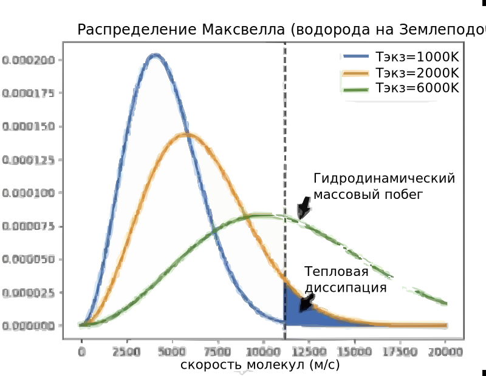

### Диссипация планетных атмосфер
<div style="float:right; font-size:50%; border-style:dashed" >
Артур Фомин, группа Б06-402
<br/>
Проект по ссылке (или куаркоду с автовходом)
<br/>
<code>артур.эвристика.рф/?folder=/home/artur/atmoescape</code>
</div>


<div style="font-size:50%">
Концентрация атмосферных газов по мере удаления от поверхности планеты уменьшается, вследствие чего длина свободного пробега их молекул растет вплоть до величин, сравнимых с размерами самой атмосферы. 

Таким образом, молекулы в верхних слоях атмосферы имеют высокую вероятность приобрести составляющую скорости в направлении от поверх-
ности планеты и на своём пути более никогда не встретить других частиц, столкновение с которыми способно отразить эти молекулы в обратном направлении. Если скорость поступательного движения молекул превышает вторую космическую для данной планеты, то молекула имеет шансы навсегда покинуть её атмосферу. Это приводит к постепенному рассеянию – диссипации – планетных атмосфер.

В данном вопросе предлагается исследовать различные механизмы диссипации (помимо вышеописанного) и оценить вклад каждого из них в скорость рассеяния атмосферы, на основе чего можно спрогнозировать время жизни, например, атмосферы Земли.
</div>

### Тепловая диссипация


*Тепловая диссипация* — это процесс
- малые газовые молекулы
    - сталкиваются друг с другом
    - некоторые достигают «второй космической»
        - такие есть всегда, при любой температуре!
            - но снизу не сможет улететь!
            - столкнется!
- сбежать можно из **экзосферы**                
    - плотность настолько мала
        - → вероятность столкновения пренебрежимо мала
    - нижняя граница → **экзобаза**
        - Экзобаза Земли ≈ `500 км`
            - температура там ≈ `1000 K`
        - проверим и посчитаем!                
- заметна для планет меньших Земли 
    - 2K меньше
    - но реально всегда учитывают излучение звезды


[Максвелловское распределение](https://ru.wikipedia.org/wiki/%D0%A0%D0%B0%D1%81%D0%BF%D1%80%D0%B5%D0%B4%D0%B5%D0%BB%D0%B5%D0%BD%D0%B8%D0%B5_%D0%9C%D0%B0%D0%BA%D1%81%D0%B2%D0%B5%D0%BB%D0%BB%D0%B0)
- скорости по модулю и направлению 
- для молекул газа массой $m$ при температуре $T$
- $f(v) d^{3} v=\left(\frac{m}{2 \pi k T}\right)^{\frac{3}{2}} \exp \left(-\frac{m v^{2}}{2 k T}\right) v^{2} \sin (\theta) d v d \theta d \varphi$
    - $d^{3} v=v^{2} \sin (\theta) d v d \theta d \varphi$
        - дифференциал скорости в сферических координатах





#### Высота экзобазы

---

Уравнение состояния идеального газа:  
- $p V=N k T $ 
- $ \rightarrow n_{V}(h)=N / V=p(h) / k T$.  

Средняя длина свободного пробега:  
- $\lambda(h)=\frac{1}{\sigma n_{V}(h)}$
    - $\sigma ≈ 2 \times 10^{-19} \text{м}^2$ — эффективное сечение столкновений атомов водорода
        - в нашем случае
            - температура экзосферы 1000K → 0.1 эв
            - упругое (без ионизации)
            - $σ≈π(2a_0)2$
            - Grok дал разброс 3–10 Ų
            - Gemini  8.8Ų
    - $n_{V}$ — концентрация молекул. 
- → $\lambda(h)=k T / \sigma p(h)$.  


Экзобаза — высота,  выше которой
- частица, движущаяся радиально наружу, 
- [в среднем менее одного](!) рассеяния. 
- → *средняя длина свободного пробега* $\lambda$ равна [шкале высоты](https://ru.wikipedia.org/wiki/%D0%92%D1%8B%D1%81%D0%BE%D1%82%D0%B0_%D0%BE%D0%B4%D0%BD%D0%BE%D1%80%D0%BE%D0%B4%D0%BD%D0%BE%D0%B9_%D0%B0%D1%82%D0%BC%D0%BE%D1%81%D1%84%D0%B5%D1%80%D1%8B) $H$ 
    - высоте, где плотность атмосферы в $e$ меньше поверхности 
        - «… Так, для высоты 275 км были получены значения $H$ 60 км в 1958 году и 40 км в 1960—1961 годах…»
    
Например, 
- из моделей 
    - [NRLMSISE-00](https://en.wikipedia.org/wiki/NRLMSISE-00), 
    - [US Standard Atmosphere 1976](https://www.ngdc.noaa.gov/stp/space-weather/online-publications/miscellaneous/us-standard-atmosphere-1976/us-standard-atmosphere_st76-1562_noaa.pdf)
    - [таблица википедии](https://ru.wikipedia.org/wiki/%D0%A1%D1%82%D0%B0%D0%BD%D0%B4%D0%B0%D1%80%D1%82%D0%BD%D0%B0%D1%8F_%D0%B0%D1%82%D0%BC%D0%BE%D1%81%D1%84%D0%B5%D1%80%D0%B0)
- Высота $200 \mathrm{~km}$
     - $p(h) ≈ 8,53⋅10^{−5} \mathrm{~Pa}$ 
     - $T ≈ 854,4 \mathrm{~K}$ 
        - зависит от Солнечной активности
     - → $\lambda≈ 2,3361⋅10^2 \mathrm{м}$ 
     - еще [не экзосфера](@), эктобаза выше
     - смоделируем экспоненциальное убывание c этой высоты
        - хотя в экзосфере, выше гомосферы тоже не очень работает Больцман, как раз из-за улетучивания    

Плотность атмосферы экспоненциально убывает с высотой
- будем отсчитывать с этих `200 км`:
$$
P(h)=P_{отсчета} \exp\left(-\frac{h-h_{отсчета}}{H}\right)
$$


Экзосфера, когда $\lambda\left(h_{экзосф}\right)=H$. 

- → $k T / \sigma p\left(h_{экзосф}\right)=H$
- → $p\left(h_{экзосф}\right)=k T / \sigma H$  

> Детальные расчеты с допусками и единицами измерения 
> - в `notes/расчеты-к-испарению.ipynb`
> - там же можно «поиграть» с входными параметрами.

$p_{\text{отсчета}} / p\left(h_{экзосф}\right)=\exp \left(\frac{h_{экзосф}-h_{\text{отсчета}}}{H}\right)$,  
- → $h_{экзосф}=h_{\text{отсчета}}+H \ln \left(p_{\text{отсчета}} / p\left(h_{экзосф}\right)\right)$

В `notes/расчеты-к-испарению.ipynb` 
- было:
```
(4.4+/-0.5)e+02 kilometer
```
- что похоже на
    - *Экзобаза Земли находится на высоте примерно 500–1000 км над уровнем моря, в зависимости от солнечной активности*


----

## Поток атмосферного испарения

Атомы на экзобазе с достаточной внешней скоростью 
- → преодолеют гравитационное притяжение.

Определим вероятность:
- что атом водорода имеет скорость,         
    - превышающую вторую космическую 
    скорость 
        - на экзобазе. 

Интегрируем распределение Максвелла,
$$
f(v) d^{3} v=\left(\frac{m}{2 \pi k T}\right)^{\frac{3}{2}} \exp \left(-\frac{m v^{2}}{2 k T}\right) v^{2} \sin (\theta) d v d \theta d \varphi 
$$
- по $\varphi$ от $-\pi$ до $\pi$ 
- по $\theta$ от $0$ до $\pi$

$$
w(v) \mathrm{d} v=\left(\frac{m}{2 \pi k T}\right)^{3 / 2} \exp \left(-\frac{m v^{2}}{2 k T}\right) v^{2} \mathrm{~d} v \cdot 2 \pi \cdot 2
$$
Получаем распределение модуля скорости:  
$$
w(v)=\sqrt{\frac{2 m^{3}}{\pi k^{3} T^{3}}} \exp \left(-\frac{m v^{2}}{2 k T}\right) v^{2} \mathrm{~d} v
$$


Скорость побега, 2K, известна, но можно пересчитать:
- $v_{\text{esc }}=\sqrt{2 G M_{\text{Земли }} /\left(R_{\text{Земли }}+h_{экзосферы}\right)}=1.084 \cdot 10^{4} \mathrm{~m} / \mathrm{s}$

 В `notes/расчеты-к-испарению.ipynb` 
- было:
```
 (1.082+/-0.004)e+04 meter/second

 10815.97357436471+/-42.981716415365625
```
- Похоже на общеизвестные `11` км/c, но меньше
    - но для твердых тел наверно учитываются столкновения  


Остальные константы:
- $m=1.008 \mathrm{u}$
- $k=1.381 \cdot 10^{-23} \mathrm{Дж} / \mathrm{K}$
- $R_{Земли}=6.37 \times 10^{6} \mathrm{~м}$
- $T_{экз} \approx 1000 \mathrm{~K}$.
    - Температура на экзобаре очень неочевидна
        - Получается измерениями
        - Например, на [Венере всего 350K, хотя планета горячая](https://youtu.be/H3BIZU7Bjw4?t=825).

Вероятность побега:  
$$
P=\sqrt{\frac{2 m^{3}}{\pi k^{3} T^{3}}} \int_{v=v_{\mathrm{esc}}}^{\infty} \exp \left(-\frac{m v^{2}}{2 k T}\right) v^{2} \mathrm{~d} v=2.7 \cdot 10^{-3}
$$  

В `notes/расчеты-к-испарению.ipynb` 
- было:
```
0.00270759621084221
```
- не получилось 🤷 😭 
    - сохранить неопределенность после интегрирования
    - когда-нибудь поисследовать 🤔


----

Определим поток убегающих атомов водорода $\Phi$
- количество частиц на единицу площади в единицу времени
- концентрация атомов водорода на экзобазе составляет $n_{H}=10^{11} \mathrm{~м}^{-3}$.


Рассмотрим элемент поверхности $\mathrm{d} A$
- нормаль по радиусу Земли 

Беглецы с $v >= v_{esc}$ улетят, если
- радиальная компонента направлена вверх
- в экзосфере столкновениями можно пренебречь

Объем, из которого частицы со скоростью $\mathbf{v}$ пройдут через $\mathrm{d} A$ за время $\mathrm{d} t$:  
- $\mathrm{d}^{2} V=v \cos \theta \cdot \mathrm{~d} A \mathrm{~d} t$.

> тут бы надо картинку бы нарисовать

Число атомов водорода в этом объеме:  
- $\mathrm{d}^{2} N=n_{\mathrm{H}} v \cos \theta \cdot \mathrm{~d} A \mathrm{~d} t$.

Число атомов с вектором скорости $\mathbf{v}$:  
- $
\mathrm{d}^{5} N_{\mathbf{v}}=n_{\mathrm{H}}\left(\frac{m}{2 \pi k T}\right)^{3 / 2} \exp \left(-\frac{m v^{2}}{2 k T}\right) v^{3} \mathrm{~d} v \cdot \sin \theta \cos \theta \mathrm{~d} \theta \cdot \mathrm{~d} \varphi \cdot \mathrm{~d} A \mathrm{~d} t
$

Интегрируя по $\theta$ (0 до $\pi/2$) и $\varphi$ ($-\pi$ до $\pi$):  
$$
\mathrm{d}^{3} N_{v}=n_{\mathrm{H}} \sqrt{\frac{m^{3}}{8 \pi k^{3} T^{3}}} \exp \left(-\frac{m v^{2}}{2 k T}\right) v^{3} \mathrm{~d} v \mathrm{~d} A \mathrm{~d} t
$$

Поток испаряющихся атомов:  
$$
\Phi=n_{\mathrm{H}} \sqrt{\frac{m^{3}}{8 \pi k^{3} T^{3}}} \int_{v=v_{\mathrm{esc}}}^{\infty} \exp \left(-\frac{m v^{2}}{2 k T}\right) v^{3} \mathrm{~d} v
$$


В `notes/расчеты-к-испарению.ipynb`
- → `783525351902.222` (в $\frac{1}{\mathrm{~м}^{2} \mathrm{~с}}$)

----

## Испарение атмосферы

Факты:
- Моль масса атмосферы $M_{атм}=29 \frac{г}{моль}$
    - $P_{0}=10^{5} \mathrm{~Па}$
- Улетает атомарный водород
    - в экзосфере он распадается на атомы
        - солнечное излучение разбивает
    - Доля водорода в атмосфере равна $\chi_{H}=5.5 \times 10^{-5} \%$        
- С экзосферы
    - На эктобазе будем считать концентрация водорода постоянна
- «Все никогда не улетит»
    - будет уменьшаться по экспоненте

Посчитаем «атмосферу в атомах водорода».

Сила, действующая на поверхность Земли:  
- $F=P_{0} \cdot 4 \pi R_{\text{Земли }}^{2}=m g$
    - → $m=4 \pi R_{\text{Земли }}^{2} P_{0} / g$.  

Число молекул в атмосфере:  
- $N=N_{\mathrm{A}} \cdot m / M_{\text{air }}=1.115 \cdot 10^{44}$.  

Число атомов водорода:  
$$
N_{\mathrm{H}}=2 \chi_{\mathrm{H}} \cdot N=1.226 \cdot 10^{38}
$$

---

Прикинем «полураспад» водорода
- «улетела половина атомов водорода»
- не будем учитывать возобновление, гидросферу и т.п.

Число улетающих атомов в единицу времени:  
- $I_{\mathrm{H}}=\Phi \cdot 4 \pi\left(R_{\text{Земли }}+h_{экзосф}\right)^{2}=4.35 \cdot 10^{26} \frac{1}{\mathrm{c}}$.  

Время «полураспада»:  
- $
\tau_{\mathrm{H}}=\frac{N_{\mathrm{H}} / 2}{I_{\mathrm{H}}}=1.41 \cdot 10^{11} \mathrm{~с} \approx  5 \cdot 10^3 \text{ лет.}
$


---

Полную потерю 
- считать бессмысленно
- даже после испрарения океанов
    - будет другая атмосфера, с другими газами
        - как на Марсе, который потерял воду
- [нужна модель с учетом изменения](!) светимости Солнца        


